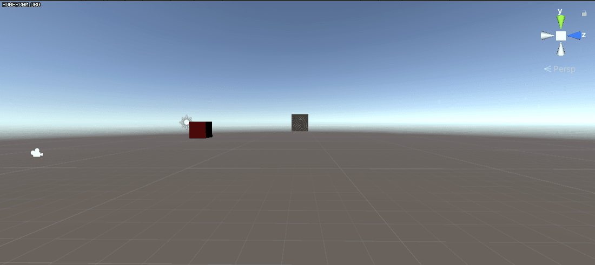

# TRS
manipulate 3D object's Transform and Rotation in 3D Coordinates.

> VRSickness/TRS/Assets/

### C31.cs  
* make child object(C31) rotated arount parent object(P31)  
	
    
### P41.cs
* make object object's rotation degree(P41) equal to double degree of another object(P42) of same level

### HeadTracking.cs  

---
