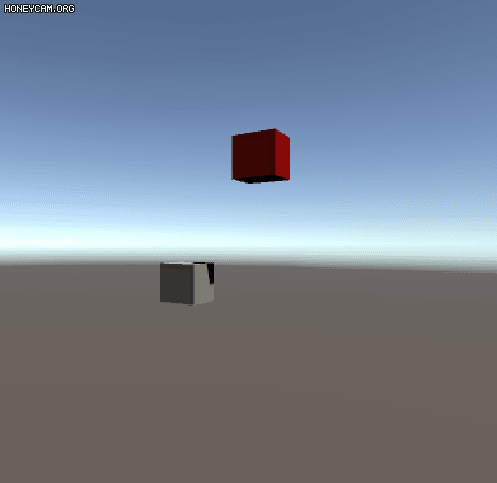
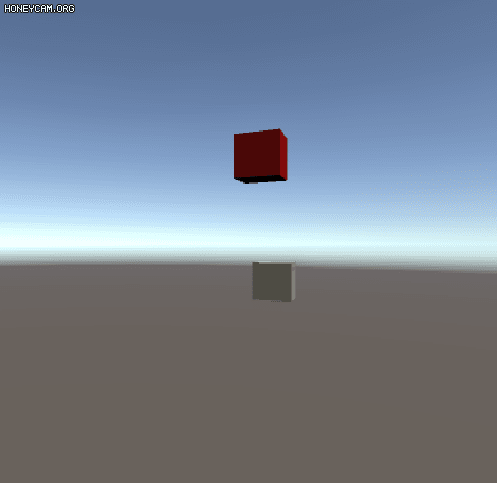
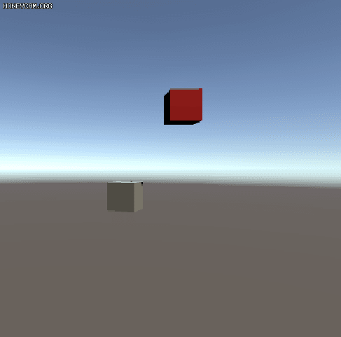

# VRS
VR기기 착용시 나타나는 어지러움 증상을 연구하기위한 시뮬레이션 환경 개발 프로젝트입니다.
KIST의 WRL 연구실에서 학생인턴으로 근무하며 개발했던 것 중 일부를 자료로 남겼습니다.

### 컨트롤러를 이용한 IP주소 입력 영상  
[]https://youtu.be/DFq0pHyDQYo  
### VR기기 - PC 소켓 프로그래밍 영상  
[]https://youtu.be/U0etC92D2-M  
### 절두체 영역 배율 확대 영상  
[]https://youtu.be/cL-hcOBxJQo  
### UI z-index 최상위 쉐이더 적용영상  
[]https://youtu.be/jbiC355ztPo  

# TRS
manipulate 3D object's Transform and Rotation in 3D Coordinates.

> VRSickness/TRS/Assets/

### C31.cs  
* make child object(C31) rotated arount parent object(P31)  
	
    
### P41.cs
* make object object's rotation degree(P41) equal to double degree of another object(P42) of same level

### RigRotation.cs  
 With Unity XR API, Virtual Camera Object's rotation and transform values are determined by Information of In Real VR HMD Device. Developer Can't manipulate Virtual Camera's Rotation value. But a Lab requires function that experimenter can manipulate it, So I try to control parent object instead Virtual Camera to offset camera's rotation and It is now possible to control the degree of Camera object rotation as the HMD rotates.

Rig(White Cube)
	Camera(Red Cube)
Camera is rotated by Script
	Camera *= Quaternion.Euler(0,1,0);
#### Rotation rate : 0

The camera seems to doesn't rotate. Because rotation of camera's parent object(Rig) offset rotation of camera

#### Rotation rate : 1

The Camera is rotated nomally.

#### Rotation rate : 0.5

Half of Rotation of Camera is offseted by rotation of parent object. It looks like to spin slowly.

#### Rotation rate : 2
 
 It is rotated more fast

 
 